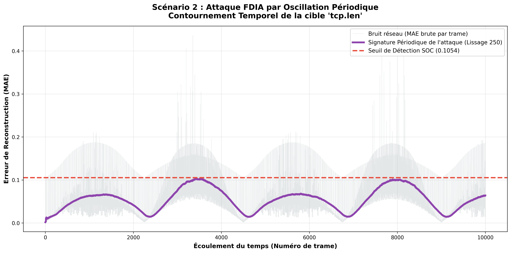
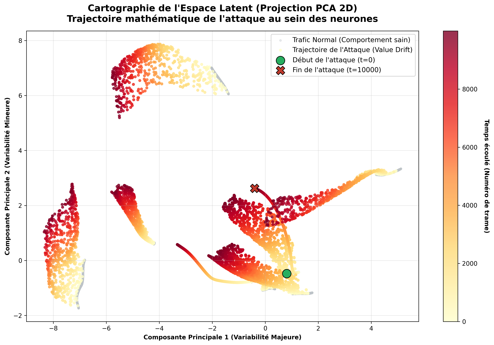

# Détection d'Intrusion IoT & Ingénierie du Chaos (Machine Learning)

**Auteur :** Kaan BILGIC  
**Projet étudiant Ingénieur - Université de Technologie de Troyes** 

## Contexte du Projet
La prolifération des objets connectés (IoT) dans les environnements industriels (IIoT) offre de nouvelles surfaces d'attaque. Si les systèmes de détection d'intrusion (IDS) classiques parviennent à bloquer les attaques volumétriques (DDoS, Scans massifs), ils peinent face aux menaces dites "furtives". 

Ce projet vise à analyser la robustesse d'intelligences artificielles non supervisées (**Isolation Forest** et **Deep Autoencoder**) face à des attaques par injection de fausses données (FDIA - *False Data Injection Attacks*) sur le dataset **Edge-IIoTset**.

## Objectifs & Découvertes Clés
1. **Démonstration du "Data Leakage" :** Mise en évidence des biais d'apprentissage où l'IA se repose sur des artefacts de capture (adresses IP, ports, drapeaux TCP) plutôt que sur la véritable géométrie du trafic réseau.
2. **Étude d'Ablation :** Stérilisation progressive des données pour révéler l'angle mort des modèles d'apprentissage non supervisés.
3. **Ingénierie du Chaos (Attaques Temporelles) :** Création mathématique de trois scénarios FDIA (Dérive lente, Oscillation, Bruit composite) capables de contourner les seuils de détection des SOC (Security Operations Centers).
4. **Analyse de l'Espace Latent :** Cartographie par réduction de dimension (PCA) du réseau de neurones pour visualiser la trajectoire mathématique d'un piratage.

## Architecture du Dépôt

* `data/` : Échantillons de données stérilisés et allégés (Trafic normal et mixte). *(Note : Le dataset original de 3 millions de lignes n'est pas hébergé ici pour des raisons de volumétrie).*
* `notebooks/` : 
  * `01_EDA_BoT_IoT.ipynb` : Analyse exploratoire des données.
  * `02_Crash_Test_Phase3.ipynb` : Entraînement des modèles Baseline et Crash-Test.
  * `03_Feature_Ablation_Study.ipynb` : Étude d'ablation et preuve de l'angle mort.
  * `04_Phase3_FDIA_Attacks.ipynb` : Simulation des attaques temporelles et cartographie PCA.
* `models/` : Scalers, modèles `.pkl` et `.keras` pré-entraînés.
* `images/` : Visualisations et graphiques des résultats.

## Aperçu des Résultats

### 1. Contournement par Oscillation Périodique
En faisant "respirer" l'attaque mathématiquement, le pirate parvient à frôler le seuil de détection de l'Autoencoder sans jamais déclencher l'alerte de manière durable.

### 2. Trajectoire de l'attaque dans le cerveau de l'IA
Projection PCA en 2D de l'Espace Latent de l'Autoencoder. On observe comment l'injection progressive de fausses données (du point vert au point rouge) extrait mathématiquement le comportement du capteur hors de sa zone de normalité.

## Comment lancer le projet en local
1. Clonez ce dépôt : `git clone https://github.com/Kaanb52/Detection-Intrusion-IoT-ML.git`
2. Installez les dépendances requises : `pandas`, `numpy`, `scikit-learn`, `tensorflow`, `matplotlib`.
3. Exécutez les notebooks dans l'ordre numérique depuis un environnement Jupyter.
